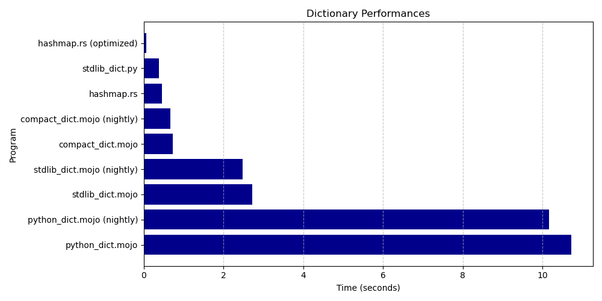

# Mojo dictionary benchmarks

This repository contains programs to benchmark different dictionary implementations in **Mojo**, with comparisons to other languages (currently Python and Rust). The main goal is to evaluate the performance of Mojo's dictionary implementations and set up a simple framework for future evaluations.

## Overview

The programs benchmark the following operations:

1. **Dictionary Initialization**: Creating and populating a dictionary-like data structure with a large number of items.
2. **Value Modification**: Modifying values for keys in the dictionary.
3. **Summation**: Calculating a sum based on the dictionary's values.

```python
...
for i in range(NUM):
    dic[str(i*2)] = i % 7
for i in range(0,NUM,2):
    dic[str(i*2)] *= 2
var sum_val = 0
for i in range(NUM):
    sum_val += dic[str(i*2)]
...
```

## Programs Benchmarked

- **Mojo**: (with Mojo 24.5 and current nightly build)
  - `stdlib_dict.mojo`: Uses Mojo's standard dictionary.
  - `compact_dict.mojo`: Uses [compact-dict](https://github.com/mzaks/compact-dict).
  - `python_dict.mojo`: Uses Python's dictionary via Mojo's [Python integration](https://docs.modular.com/mojo/manual/python/).
  

- **Python**:
  - `stdlib_dict.py`: Implements the same operations as Mojo using Pythons's standard dictionary.

- **Rust**: 
  - `hashmap.rs`: Benchmarks Rust's `HashMap`, both in standard mode and with `-C opt-level=3` for optimization.

## Requirements

- Ensure that the `Magic` command line tool is installed by following the [Modular Docs](https://docs.modular.com/magic).
- Install Rust by following the instructions here: <https://www.rust-lang.org/tools/install>

## Running the Benchmarks

To run the benchmarks, use the provided shell script:

```sh
bash ./benchmarks.sh
```
After running the benchmarks, you can view the performance comparison in `results/benchmarks.md` and a plot in `results/benchmark.png`.

## Benchmarks

| Program | Time (seconds) |
|---------|----------------|
| hashmap.rs (optimized) | 0.062228 sec |
| stdlib_dict.py | 0.378968 sec |
| hashmap.rs | 0.456287 sec |
| compact_dict.mojo (nightly) | 0.661226 sec |
| compact_dict.mojo | 0.726776 sec |
| stdlib_dict.mojo (nightly) | 2.474072 sec |
| stdlib_dict.mojo | 2.715950 sec |
| python_dict.mojo (nightly) | 10.157776 sec |
| python_dict.mojo | 10.727387 sec |



## Contributing

Contributions are welcome! If you'd like to add new benchmarks, enhance the current ones, or any suggestions, please open an issue or submit a pull request.

## Changelog

- 2024.10.11
  - Intial commit

## License

This project is licensed under the MIT License.
