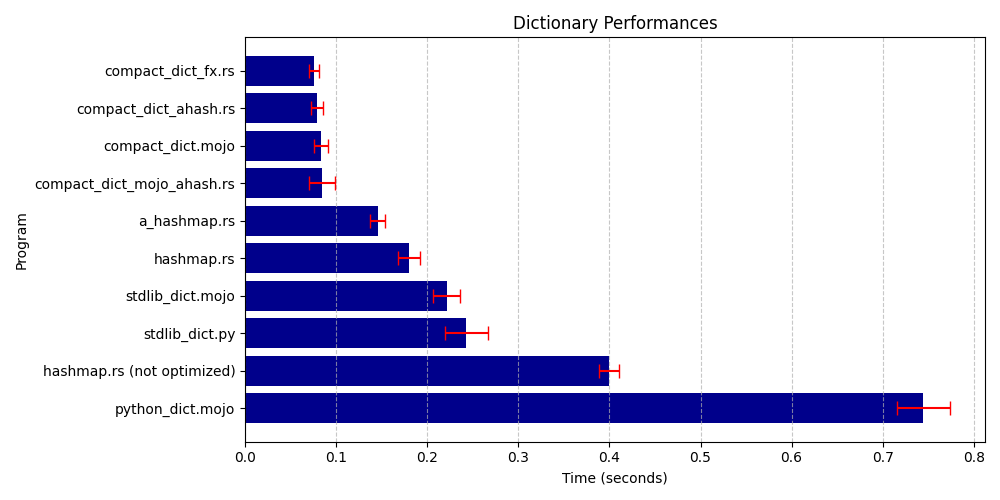

# Mojo dictionary benchmarks

This repository contains programs to benchmark different dictionary implementations
in [Mojo](https://www.modular.com/mojo), with comparisons to other languages (currently Python and Rust). The main goal
is to evaluate the performance of Mojo's dictionary implementations and set up a simple framework for future
evaluations.

## Overview

The programs benchmark the following operations:

1. **Dictionary Initialization**: Creating and populating a dictionary-like data structure with a large number of items.
2. **Value Modification**: Modifying values for keys in the dictionary.
3. **Summation**: Calculating a sum based on the dictionary's values.

```mojo
...
var keys = List[String](capacity=NUM)
for i in range(NUM):
    keys[i] = "k" + str(i)

var start = now()

var dic = Dict[String, Int]()
for i in range(NUM):
    dic[keys[i]] = i % 7
for i in range(0, NUM, 2):
    dic[keys[i]] *= 2
var sum_val = 0
for i in range(NUM):
    sum_val += dic[keys[i]]

var elapsed = (now() - start) / 1e9
...
```

## Programs benchmarked

- **Mojo**: (compiled with Mojo 25.6)
    - `stdlib_dict.mojo`: Uses Mojo's standard dictionary.
    - `compact_dict.mojo`: Uses [compact-dict](https://github.com/mzaks/compact-dict).
    - `python_dict.mojo`: Uses Python's dictionary via Mojo
      s [Python integration](https://docs.modular.com/mojo/manual/python/).

- **Python**:
    - `stdlib_dict.py`: Implements the same operations as in Mojo using Python's standard dictionary.

- **Rust**:
    - `hashmap.rs`: Benchmarks Rust's `HashMap`, both in standard mode and with `-C opt-level=3` for optimization.
    - `a_hashmap.rs`: Uses `ahash::AHashMap` instead of `std::collections::HashMap` this and next are always optimized (
      release mode).
    - `compact_dict_mojo_ahash.rs`: Reimplement both `compact_dict` and `ahash` from Mojo code in Rust.
    - `compact_dict_ahash.rs`: Reimplement only `compact_dict` but uses `ahash` from Rust libs ecosystem.
    - `compact_dict_fx.rs`: Reimplement only `compact_dict` but select hasher from `rustc_hash` specialized in short
      keys.

Rust hashers benchmark https://blog.goose.love/posts/rosetta-hashing/

## Requirements

- Install the `pixi` command line tool by following the instructions in
  the [Mojo Documentation](https://docs.modular.com/mojo/manual/get-started).
- Ensure that both Rust and Python are installed on your system.

## Running the Benchmarks

To run the benchmarks, use the provided shell script:

```sh
bash ./benchmarks.sh
```

After running the benchmarks, you can view the performance comparison in `results/benchmarks.md` and a plot in
`results/benchmark.png`.

## Benchmarks

| Benchmark                   | Mojo 24.5     | Mojo 25.5    | Mojo 25.6               | 
|-----------------------------|---------------|--------------|-------------------------|
| Measured at                 | 11 Oct 2024   | 19 Jul 2025  | 28 Aug 2025             |
| --------------------------- | ------------- | ------------ | ----------------------- |
| compact_dict_fx.rs          |               |              | 0.075556 ± 0.005110 sec |
| compact_dict_ahash.rs       |               |              | 0.079252 ± 0.006470 sec |
| compact_dict.mojo           | 0.084032 sec  | 0.079602 sec | 0.083276 ± 0.007969 sec |
| compact_dict_mojo_ahash.rs  |               |              | 0.084626 ± 0.014298 sec |
| a_hashmap.rs                |               |              | 0.145564 ± 0.007950 sec |
| hashmap.rs                  | 0.143373 sec  | 0.174457 sec | 0.179874 ± 0.012438 sec |
| stdlib_dict.mojo            | 2.523637 sec  | 0.214174 sec | 0.221199 ± 0.014452 sec |
| stdlib_dict.py              | 0.264387 sec  | 0.233545 sec | 0.242619 ± 0.023634 sec |
| hashmap.rs  (not optimized) | 0.470244 sec  | 0.398161 sec | 0.399768 ± 0.011307 sec |
| python_dict.mojo            | 10.352229 sec | 0.958389 sec | 0.744607 ± 0.029020 sec |



## Contributing

Contributions are welcome! If you'd like to add new benchmarks, enhance the current ones, or any suggestions, please
open an issue or submit a pull request.

## Changelog

- 2025.08.25
    - Std dev is now measured and depicted on graph.
    - Rust `compact dict` with `rustc_hash::FxHasher` found as `10%` faster than `mojo compact_dict` with `ahash`.
    - Mojo updated to 25.6.
- 2025.07.19
    - Code updated to reflect changes in [mojo spec](https://docs.modular.com/mojo/changelog/)
- 2024.10.12
    - Reimplemented based on feedback provided by the community on
      the [Modular Discord server](https://discord.gg/xZktyT2q).
- 2024.10.11
    - Initial commit

## License

This project is licensed under the MIT License.
